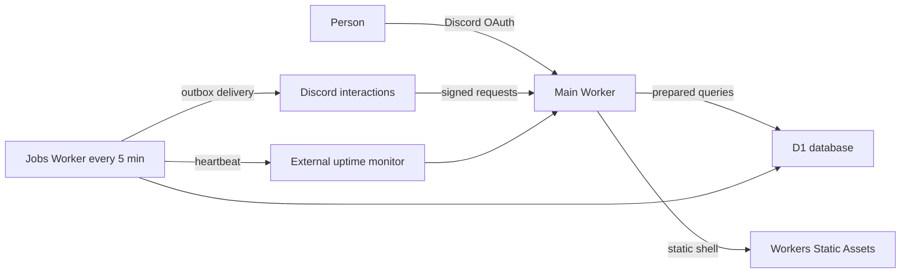

# Architecture

## Shape of the system



The main Worker owns the React assets, same-origin API, Better Auth callback, and
Discord interaction endpoint. The jobs Worker has no user-facing routes and only
processes bounded batches. Both use the same D1 database within an environment.

Staging and production have independent Workers, databases, Discord applications,
credentials, and recovery histories.

## Identity and authorization

Discord user ID is the stable identity shared by the site and bot. Better Auth
owns users, linked accounts, and sessions. Every user request is authenticated
server-side; every card mutation then checks the person’s group role. The UI
hides unavailable actions for clarity, but it is never the security boundary.

Guild membership is cached for six hours to keep normal requests quick. Missing
or stale membership is revalidated with Discord. The jobs Worker also checks a
small stale-member batch every five minutes. A person who leaves the guild is
deactivated, and private group access always remains explicitly assigned.

`INITIAL_ADMIN_DISCORD_ID` promotes only the matching account during first-user
creation. Remove the value after the first administrator has signed in and the
role has been verified.

## Data and consistency

D1 stores people, sessions, groups, memberships, boards, columns, cards, people
on cards, tags, checklists, comments, GitHub issue links, saved views,
notification preferences, change records, outbox work, and Discord idempotency
keys.

Mutations use prepared statements and role checks. Card updates include the
client’s last-seen `version`; a mismatch returns `409 version_conflict` instead
of overwriting another person’s work. Moves are optimistic in the browser and
roll back with a visible message if persistence fails.

Archivable records use timestamps instead of immediate destructive deletion.
Queries are indexed around group membership, board/column/rank, card people,
dates, comments, links, and outbox status. The dashboard refreshes every 30
seconds, after local changes, and when its tab regains focus. WebSockets are not
needed at this size.

## Discord path

The interaction endpoint verifies Ed25519 signature and timestamp before parsing
the body. It rejects interactions from any guild other than the configured guild
and claims each interaction ID in D1 so Discord retries cannot create duplicate
cards.

The bot and website call the same card service and authorization rules. Normal
responses are private; only an explicit board recap is public. The outbox keeps
scheduled or retried delivery separate from the three-second interaction path.

## GitHub issue links

A card may contain multiple canonical URLs matching:

```text
https://github.com/<owner>/<repository>/issues/<positive-number>
```

The server validates and stores the owner, repository, and issue number. The same
operation is available in the card sheet and `/card link`. This gives dependable
links without storing a broad GitHub credential. Automatic title/state sync can
later be added through a least-privilege GitHub App without changing the card
model.

## Failure boundaries

- Static assets are served without executing app code.
- The main Worker remains usable if scheduled work is delayed.
- Outbox rows are claimed before delivery and retried with bounded exponential
  delay; failures are retained for inspection.
- Discord outages produce friendly temporary errors rather than bypassing guild
  checks.
- Worker releases are immutable and reversible. Database restoration is a
  separate, human-confirmed operation.
- Logs contain correlation IDs and operational metadata, not card contents or
  credentials.
